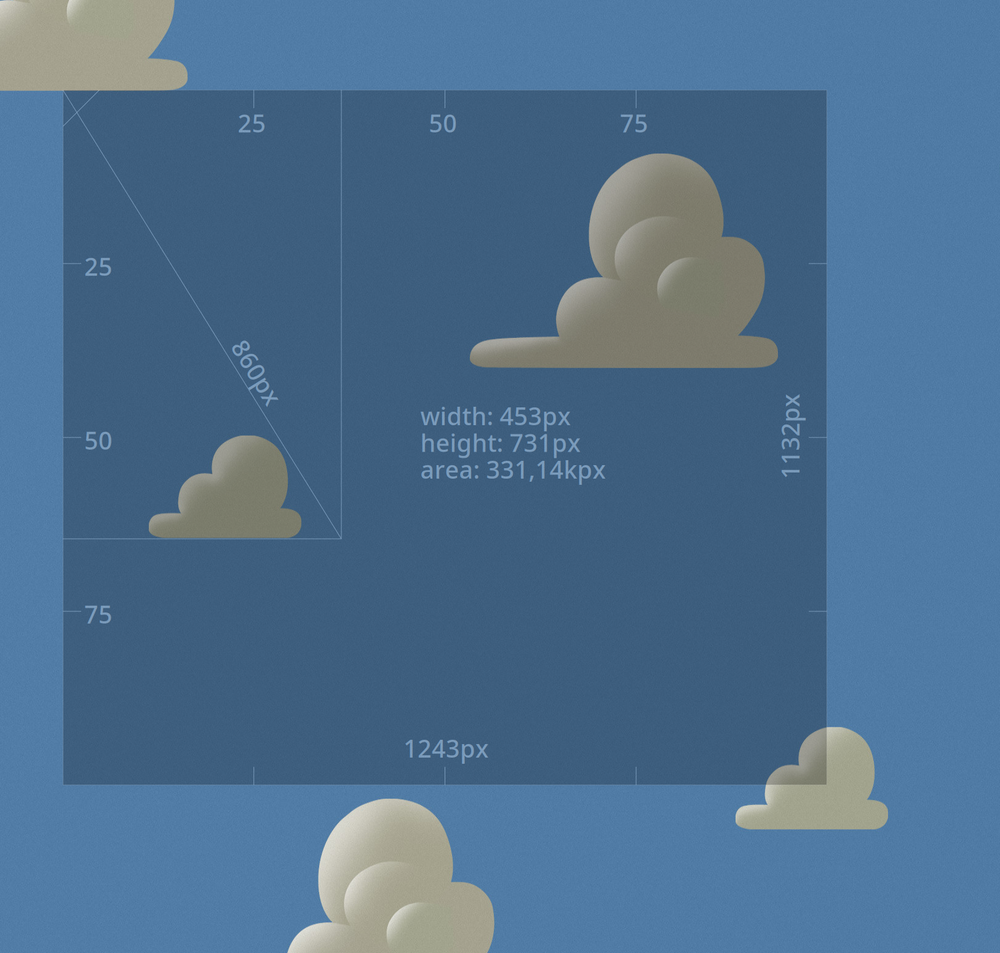
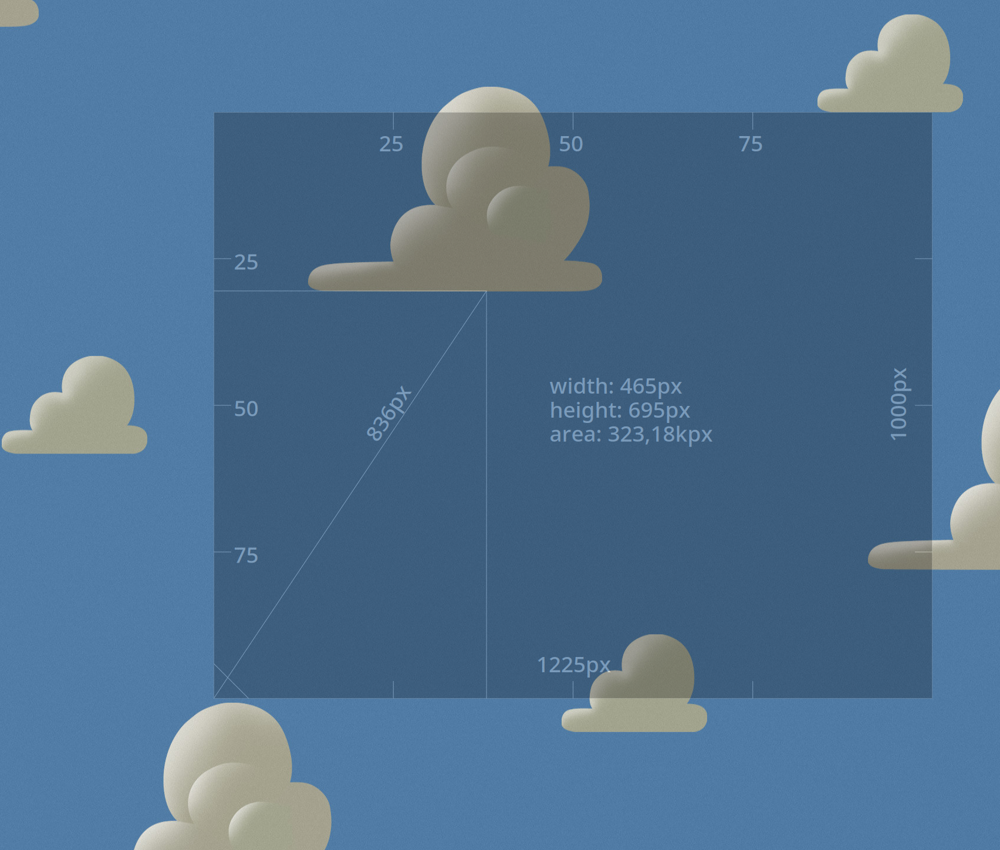
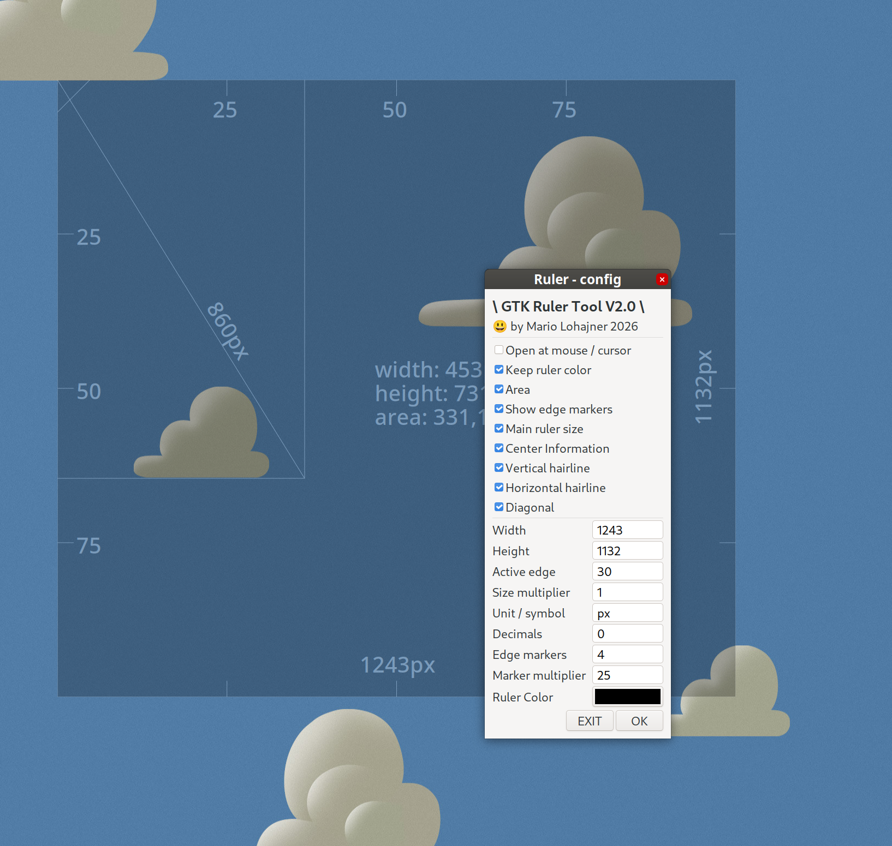

# Ruler (GTK3)

**A simple, lightweight on-screen ruler for Linux.**

Measure anything on your screen: UI elements, images, spacing, distances, and dimensions - without leaving your desktop or reaching for a screenshot editor.

Ruler is a small, native GTK3 + X11 utility designed to stay out of your way and make quick on-screen measurements effortless.

<p align="center">
  
</p>

<p align="center">
  
  
</p>

## Why Ruler?

Ever needed to know:

- How wide is that window?
- How many pixels are between these two elements?
- Is this UI element really 200 px wide?
- What is the exact size of an image or icon?
- Where exactly is that color on the screen?
- How much space is there between two objects?

Instead of taking a screenshot, opening an image editor, or guessing, **just put the ruler on the screen and measure it directly.**

Ruler is intentionally small and focused. No complicated UI, no project files, no setup - just a ruler that is always ready when you need it.

## Features

- **Measure directly on your screen** - place the ruler over anything and read its dimensions immediately.
- **Move and resize interactively** - drag the ruler or its edges just like you'd expect.
- **Works across monitors** - use it on your current display and switch to fullscreen when you need a larger measuring area.
- **Built-in color picker** - hold `C` to sample the pixel color directly under the cursor.
- **Copy measurements to the clipboard** - press `Enter` to quickly copy dimensions and color information.
- **Rotate** - press `R` to swap ruler width and height.
- **Choose your reference point** - change the measurement origin / angle with `O`.
- **Adjust transparency** - make the ruler more or less transparent so you can see what you're measuring underneath.
- **Keyboard-friendly** - move and resize precisely with the arrow keys.
- **Lightweight** - a small utility that does one job without getting in your way.

## Build

### Debian / Ubuntu

```bash
sudo apt install libgtk-3-dev libx11-dev meson ninja-build

meson setup build
ninja -C build
./build/ruler
```

### Fedora

```bash
sudo dnf builddep packaging/fedora/ruler.spec

meson setup build
ninja -C build
./build/ruler
```

## Building an RPM package (Fedora)

```bash
sudo dnf install rpm-build
sudo dnf builddep packaging/fedora/ruler.spec

# create the source tarball and run rpmbuild
# see packaging/fedora/README.md
```

## Controls

| Action | Control |
|---|---|
| Move ruler | Drag the ruler with the mouse |
| Resize | Drag the edges |
| Show options | Right-click |
| Fullscreen | Double-click on the current monitor |
| Resize proportionally | Scroll wheel |
| Change opacity | Shift + scroll wheel |
| Resize width | W + scroll wheel |
| Resize height | H + scroll wheel |
| Move | Arrow keys |
| Move in 5px increments | Ctrl + Arrow keys |
| Resize | Shift + Arrow keys |
| Resize in 5px increments | Shift + Ctrl + Arrow keys |
| Pick screen color | Hold `C` and move the cursor |
| Copy measurements | `Enter` |
| Rotate | `R` |
| Change measurement reference | `O` |
| Close | `Esc` |

## Perfect for

- Developers checking UI layouts and pixel dimensions
- Designers measuring spacing, elements, and images
- Desktop customization and theme tweaking
- QA and testing when exact screen dimensions matter
- Anyone who occasionally needs a ruler on their screen

Ruler is not a full design tool — and that's the point.

**When you just need to measure something on your screen, Ruler gets out of the way and lets you do it.**
